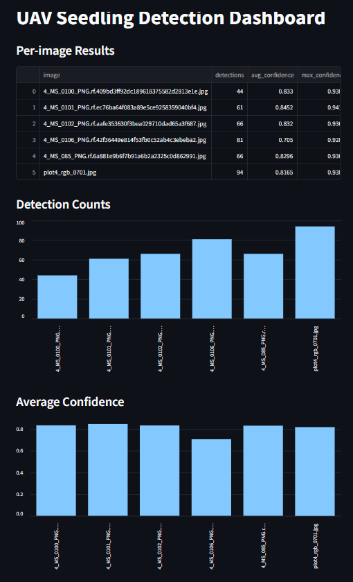
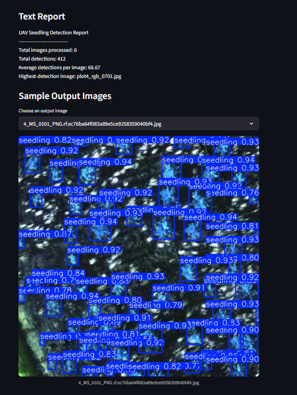

# UAV Seedling Detection and Monitoring Pipeline

## Overview
This project automates seedling detection from UAV imagery using a YOLO-based deep learning model. It processes images in batch mode, counts detections, and generates summary outputs for monitoring and reporting.

## Features
- Batch image inference
- Detection counting
- Confidence-based metrics
- CSV reporting
- Summary statistics

## Project Structure
- `src/predict.py` - batch inference
- `src/summarize.py` - summary statistics
- `outputs/results.csv` - per-image results
- `outputs/summary.csv` - project summary

## Example Output
Include one predicted image and mention the CSV outputs.

## Future Improvements
- Density estimation
- Geospatial output support
- Dashboard visualization
- LiDAR fusion

## Dashboard
This project includes a Streamlit dashboard for reviewing detection outputs, summary statistics, confidence metrics, and sample result images.
## Dashboard preview

